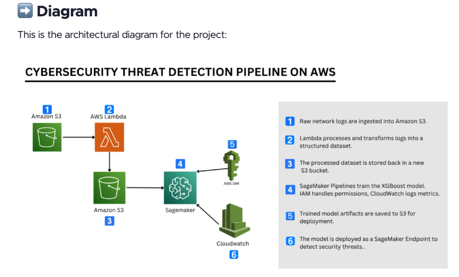
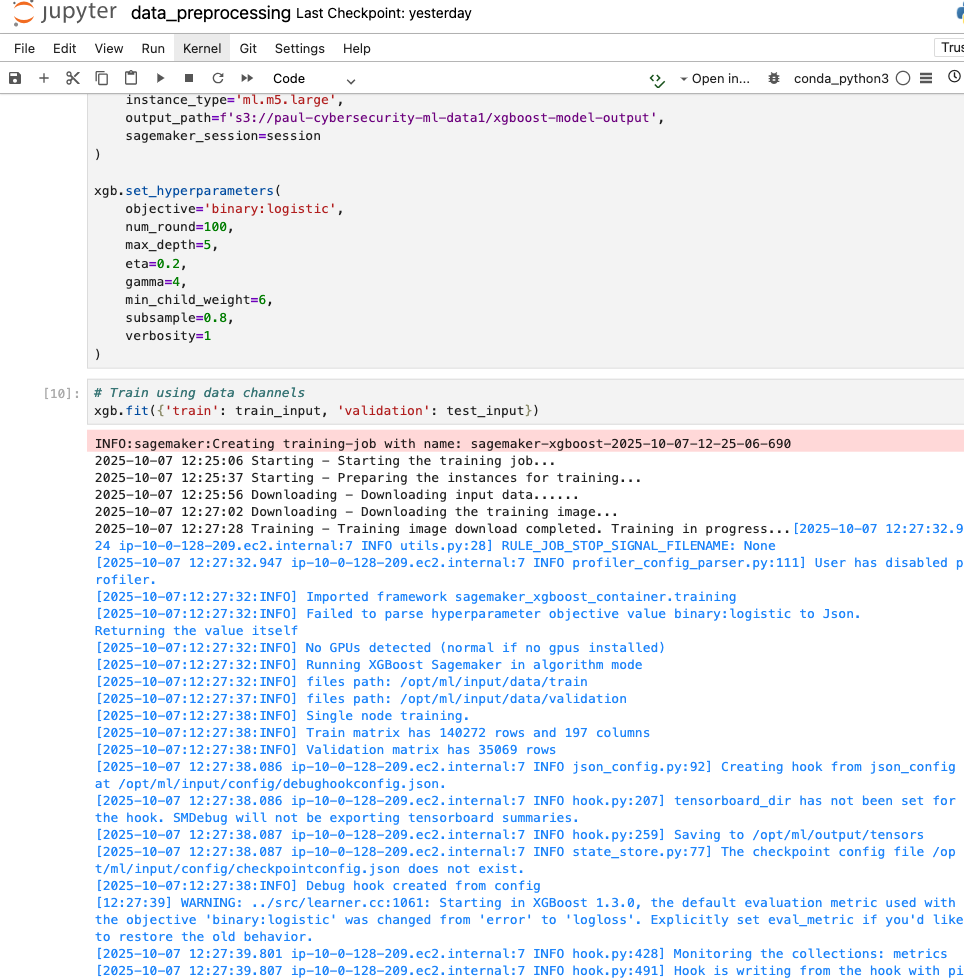
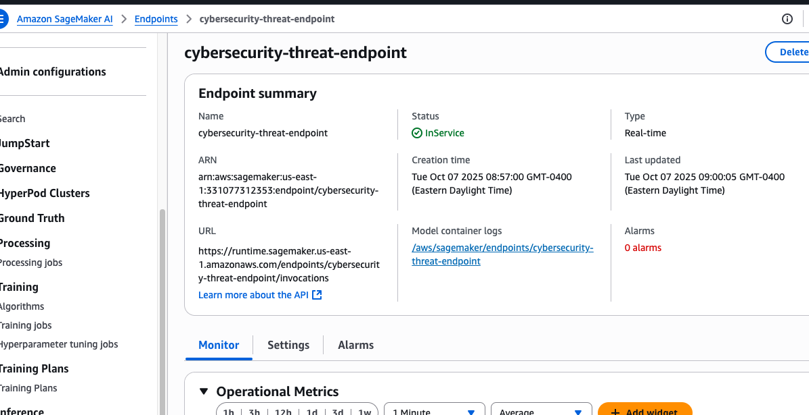
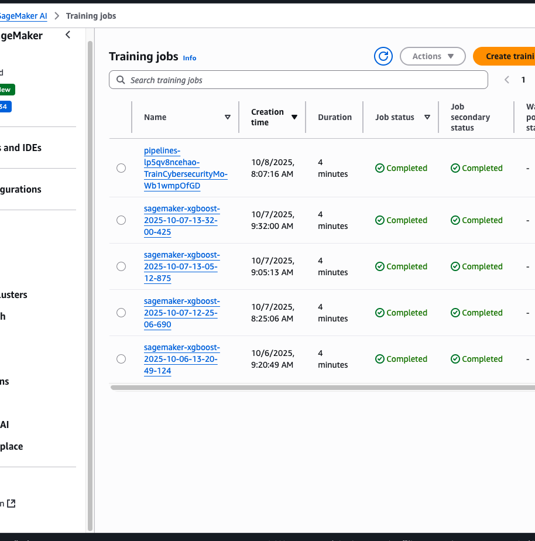

# AWS Threat Detection with ML

A hands-on cybersecurity threat detection system using Amazon SageMaker and XGBoost to identify malicious network activity in real-time.


## Overview

This project implements an end-to-end machine learning pipeline for detecting cybersecurity threats from network traffic data. The system processes raw network logs, trains an XGBoost classification model, and deploys it as a real-time inference endpoint on AWS.

**Key capabilities:**
- Classifies network traffic as benign or malicious
- Automated ML pipeline using SageMaker Pipelines
- Real-time threat detection via deployed endpoint
- Scales automatically with AWS infrastructure

## Architecture



**Data Flow:**
1. Raw network logs stored in **Amazon S3**
2. **AWS Lambda** processes and transforms logs
3. Preprocessed data stored back in **S3**
4. **SageMaker Pipelines** orchestrate model training
5. Trained model deployed as **SageMaker Endpoint**
6. **CloudWatch** monitors performance and logs threats

## Tech Stack

| Service | Purpose |
|---------|---------|
| **Amazon SageMaker** | Model training, deployment, and serving |
| **Amazon S3** | Data lake for raw/processed data and model artifacts |
| **AWS Lambda** | Serverless data preprocessing |
| **Amazon CloudWatch** | Monitoring and logging |
| **AWS IAM** | Security and permissions management |

## Implementation Steps

### 1. Data Preprocessing & Feature Engineering
- Used UNSW-NB15 network traffic dataset (175K+ samples, 45 features)
- Engineered features: byte ratios, flow intensity, common port indicators
- Applied StandardScaler normalization
- One-hot encoded categorical variables (protocol, service, state)
- [View preprocessing notebook](data_preprocessing.md)

### 2. Model Training & Evaluation
- **Algorithm:** XGBoost (binary classification)
- **Instance:** ml.m5.large
- **Hyperparameters:**
  - Max depth: 5
  - Learning rate (eta): 0.2
  - Gamma: 4
  - Min child weight: 6
  - Subsample: 0.8
- Training completed in ~4 minutes



### 3. Model Deployment & Inference
- Deployed endpoint: `cybersecurity-threat-endpoint`
- Configuration: ml.m5.large with 1 instance
- Accepts CSV input, returns threat probability score
- Prediction: THREAT if score > 0.5, else SAFE



### 4. Pipeline Automation
- Built SageMaker Pipeline to automate:
  - Data ingestion from S3
  - Model training with validation
  - Model artifact storage
- Pipeline execution: ~4 minutes end-to-end

## Results

- **Training completed:** Multiple successful training jobs
- **Model accuracy:** High performance on UNSW-NB15 dataset
- **Endpoint status:** InService and ready for real-time inference
- **Pipeline automation:** Fully functional for continuous training



## What I Learned

- Building production ML pipelines on AWS SageMaker
- Implementing feature engineering for cybersecurity data
- Deploying scalable, real-time inference endpoints
- Automating ML workflows with SageMaker Pipelines
- Cloud-native ML architecture best practices

## Project Structure

```
aws-threat-detection-ml/
├── README.md                    # This file
├── data_preprocessing.md        # Jupyter notebook with code & outputs
└── images/                      # Architecture diagrams and screenshots
```

## Future Enhancements

- Add real-time alerting with SNS/EventBridge
- Implement model drift detection and auto-retraining
- Add A/B testing for model variants

## Acknowledgments

This project was completed as part of my cloud engineering learning journey. Special thanks to [TechWithLucy](https://www.zerotocloud.com/) for the comprehensive course materials that guided this implementation.

---

