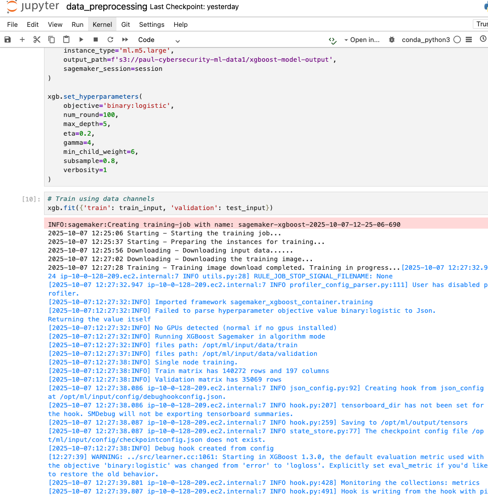
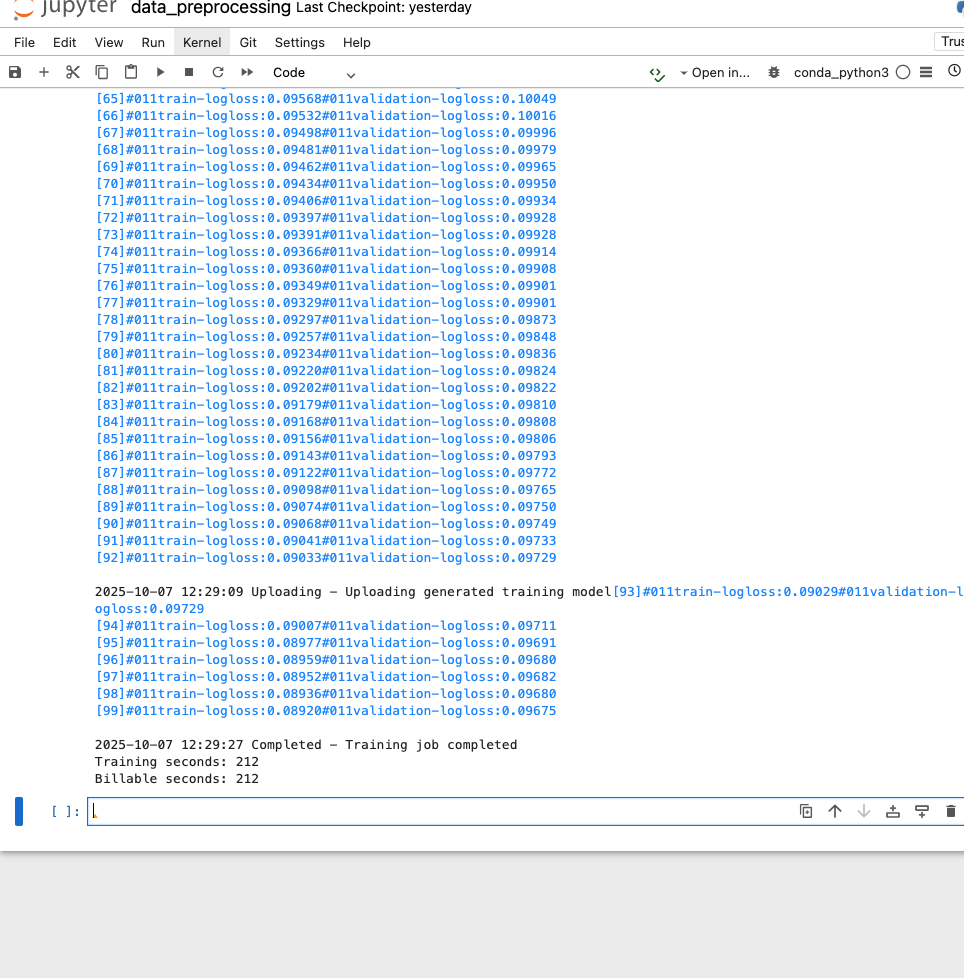
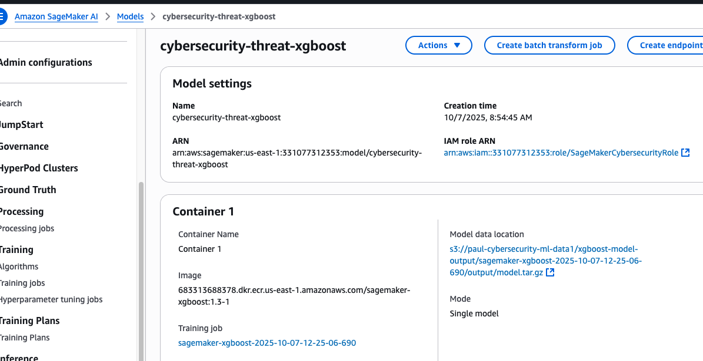
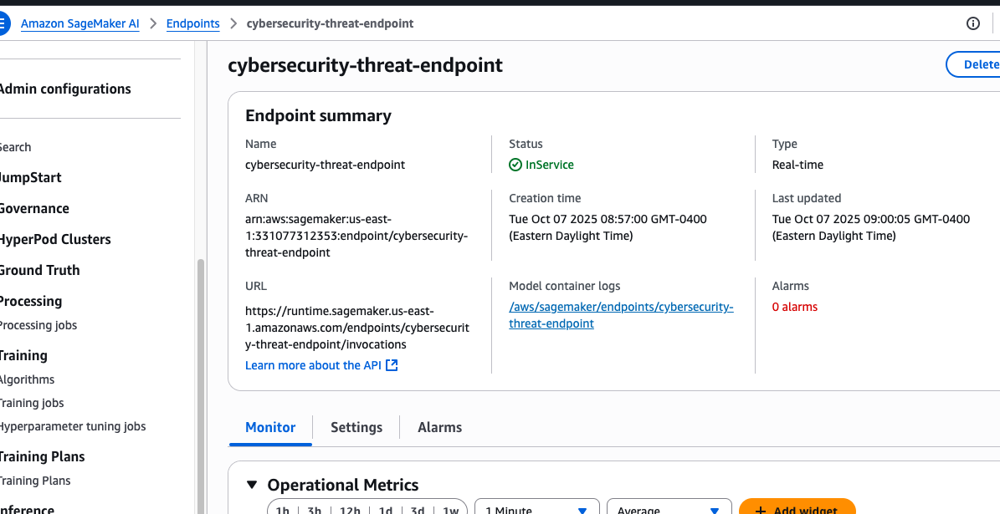
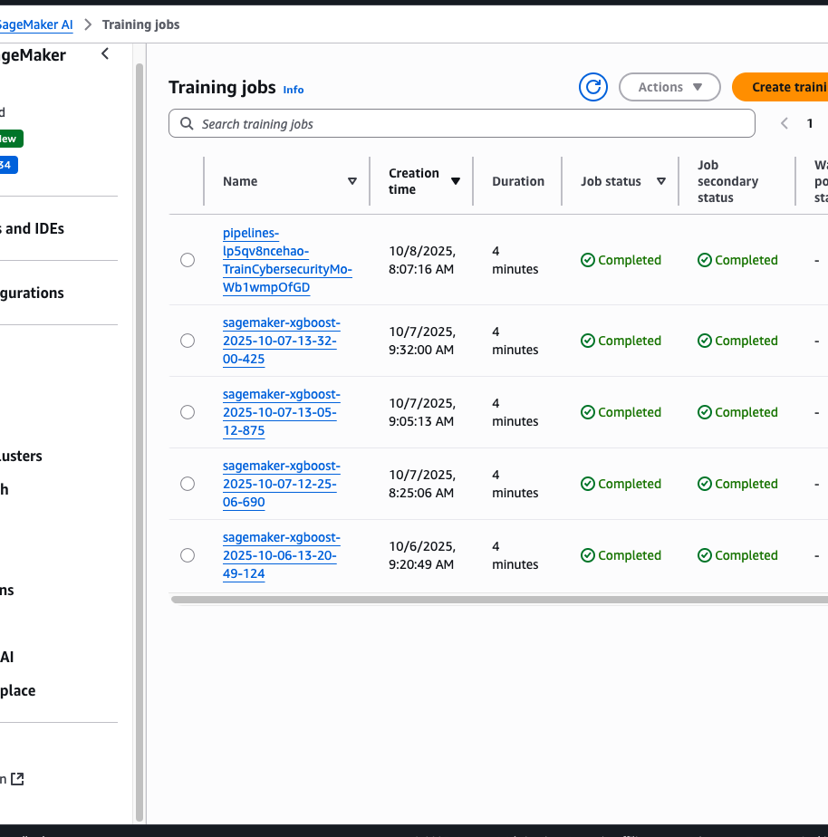

# Data Preprocessing & Model Training Notebook

This notebook demonstrates the complete machine learning pipeline for cybersecurity threat detection, from data ingestion to model deployment.

---

## Step 1: Data Ingestion from S3

Loading the UNSW-NB15 network traffic dataset from Amazon S3.

```python
import boto3
import pandas as pd
import io

# Setup S3 client
s3_client = boto3.client('s3')

# Download the file into memory
response = s3_client.get_object(Bucket='paul-cybersecurity-ml-data1', Key='raw-data/UNSW_NB15_training-set.csv')

# Read it into pandas
df = pd.read_csv(io.BytesIO(response['Body'].read()))

# Explore
print(df.shape)
print(df.columns)
print(df.head())
print(df['label'].value_counts())
```

    /home/ec2-user/anaconda3/envs/python3/lib/python3.10/site-packages/pandas/core/computation/expressions.py:21: UserWarning: Pandas requires version '2.8.4' or newer of 'numexpr' (version '2.7.3' currently installed).
      from pandas.core.computation.check import NUMEXPR_INSTALLED


    (175341, 45)
    Index(['id', 'dur', 'proto', 'service', 'state', 'spkts', 'dpkts', 'sbytes',
           'dbytes', 'rate', 'sttl', 'dttl', 'sload', 'dload', 'sloss', 'dloss',
           'sinpkt', 'dinpkt', 'sjit', 'djit', 'swin', 'stcpb', 'dtcpb', 'dwin',
           'tcprtt', 'synack', 'ackdat', 'smean', 'dmean', 'trans_depth',
           'response_body_len', 'ct_srv_src', 'ct_state_ttl', 'ct_dst_ltm',
           'ct_src_dport_ltm', 'ct_dst_sport_ltm', 'ct_dst_src_ltm',
           'is_ftp_login', 'ct_ftp_cmd', 'ct_flw_http_mthd', 'ct_src_ltm',
           'ct_srv_dst', 'is_sm_ips_ports', 'attack_cat', 'label'],
          dtype='object')
       id       dur proto service state  spkts  dpkts  sbytes  dbytes       rate  \
    0   1  0.121478   tcp       -   FIN      6      4     258     172  74.087490
    1   2  0.649902   tcp       -   FIN     14     38     734   42014  78.473372
    2   3  1.623129   tcp       -   FIN      8     16     364   13186  14.170161
    3   4  1.681642   tcp     ftp   FIN     12     12     628     770  13.677108
    4   5  0.449454   tcp       -   FIN     10      6     534     268  33.373826

       ...  ct_dst_sport_ltm  ct_dst_src_ltm  is_ftp_login  ct_ftp_cmd  \
    0  ...                 1               1             0           0
    1  ...                 1               2             0           0
    2  ...                 1               3             0           0
    3  ...                 1               3             1           1
    4  ...                 1              40             0           0

       ct_flw_http_mthd  ct_src_ltm  ct_srv_dst  is_sm_ips_ports  attack_cat  \
    0                 0           1           1                0      Normal
    1                 0           1           6                0      Normal
    2                 0           2           6                0      Normal
    3                 0           2           1                0      Normal
    4                 0           2          39                0      Normal

       label
    0      0
    1      0
    2      0
    3      0
    4      0

    [5 rows x 45 columns]
    label
    1    119341
    0     56000
    Name: count, dtype: int64

**Dataset Summary:**
- **175,341 samples** with **45 features**
- **Imbalanced classes:** 119,341 malicious (label=1) vs 56,000 benign (label=0)
- Features include network metrics: duration, packets, bytes, protocols, services, connection states

---

## Step 2: Feature Engineering & Preprocessing

```python
# --- 1. Drop irrelevant columns ---
df = df.drop(columns=['id', 'attack_cat'])

# --- 2. Feature engineering BEFORE encoding/scaling ---
df['byte_ratio'] = df['sbytes'] / (df['dbytes'] + 1)
df['is_common_port'] = df['ct_dst_sport_ltm'].isin([80, 443, 22]).astype(int)
df['flow_intensity'] = (df['spkts'] + df['dpkts']) / (df['dur'] + 1e-6)

# --- 3. One-hot encode categorical columns ---
categorical_cols = ['proto', 'service', 'state']
df = pd.get_dummies(df, columns=categorical_cols)

# Convert booleans to ints
df = df.astype({col: 'int' for col in df.columns if df[col].dtype == 'bool'})

# --- 4. Scale numerical features (except label) ---
from sklearn.preprocessing import StandardScaler

numerical_cols = df.select_dtypes(include=['int64', 'float64']).columns.tolist()
numerical_cols.remove('label')

scaler = StandardScaler()
df[numerical_cols] = scaler.fit_transform(df[numerical_cols])

# --- Checks ---
print(df.shape)                                  # Final number of rows & columns
print(df.head())                                 # Preview first few rows
print(df.describe().T[['mean', 'std']])          # Confirm scaling stats
print(df[numerical_cols].mean().round(3))        # Should be ~0
print(df[numerical_cols].std().round(3))         # Should be ~1
```

    (175341, 198)
            dur     spkts     dpkts    sbytes    dbytes      rate      sttl  \
    0 -0.191029 -0.104456 -0.135769 -0.049134 -0.102726 -0.576371  0.703839
    1 -0.109485 -0.046014  0.172599 -0.046410  0.188544 -0.576345 -1.141901
    2  0.040699 -0.089845 -0.026933 -0.048527 -0.012133 -0.576734 -1.141901
    3  0.049729 -0.060624 -0.063212 -0.047016 -0.098563 -0.576737 -1.141901
    4 -0.140417 -0.075235 -0.117630 -0.047554 -0.102057 -0.576617  0.723268

           dttl     sload     dload  ...  service_ssl  state_CON  state_ECO  \
    0  1.578100 -0.389897 -0.273700  ...    -0.017874  -0.284764  -0.008273
    1  1.560002 -0.389928 -0.069233  ...    -0.017874  -0.284764  -0.008273
    2  1.560002 -0.389964 -0.252044  ...    -0.017874  -0.284764  -0.008273
    3  1.560002 -0.389958 -0.275821  ...    -0.017874  -0.284764  -0.008273
    4  1.560002 -0.389927 -0.275561  ...    -0.017874  -0.284764  -0.008273

       state_FIN  state_INT  state_PAR  state_REQ  state_RST  state_URN  state_no
    0   1.119382  -0.940239  -0.002388   -0.10717  -0.021762  -0.002388 -0.002388
    1   1.119382  -0.940239  -0.002388   -0.10717  -0.021762  -0.002388 -0.002388
    2   1.119382  -0.940239  -0.002388   -0.10717  -0.021762  -0.002388 -0.002388
    3   1.119382  -0.940239  -0.002388   -0.10717  -0.021762  -0.002388 -0.002388
    4   1.119382  -0.940239  -0.002388   -0.10717  -0.021762  -0.002388 -0.002388

    [5 rows x 198 columns]
                       mean       std
    dur       -3.241878e-18  1.000003
    spkts     -1.426426e-17  1.000003
    dpkts      5.187005e-18  1.000003
    sbytes    -1.053610e-18  1.000003
    dbytes     1.410217e-17  1.000003
    ...                 ...       ...
    state_PAR -1.347406e-18  1.000003
    state_REQ  3.930777e-18  1.000003
    state_RST -2.917690e-18  1.000003
    state_URN  7.902078e-19  1.000003
    state_no   7.902078e-19  1.000003

    [198 rows x 2 columns]

**Preprocessing Results:**
- **198 features** after one-hot encoding (from 45 original)
- **StandardScaler applied:** Mean ≈ 0, Std ≈ 1
- **Engineered features:** byte_ratio, is_common_port, flow_intensity

---

## Step 3: Upload Preprocessed Data to S3

```python
import sagemaker
from sagemaker import get_execution_role

# Create SageMaker session and define bucket
session = sagemaker.Session()
bucket = 'paul-cybersecurity-ml-data1'  # Replace with your actual S3 bucket name
processed_prefix = 'processed-data'      # Folder in S3 to store processed files

# Save preprocessed data locally
df.to_csv('preprocessed_data.csv', index=False)

# Upload to S3 inside the 'processed-data/' folder
s3_path = session.upload_data(
    path='preprocessed_data.csv',
    bucket=bucket,
    key_prefix=processed_prefix
)

print(f"Preprocessed data uploaded to: {s3_path}")
```

    sagemaker.config INFO - Not applying SDK defaults from location: /etc/xdg/sagemaker/config.yaml
    sagemaker.config INFO - Not applying SDK defaults from location: /home/ec2-user/.config/sagemaker/config.yaml

---

## Step 4: Train-Test Split & Data Formatting

```python
import pandas as pd
import boto3
import sagemaker

# Set up session and bucket
session = sagemaker.Session()
bucket = 'paul-cybersecurity-ml-data1'
processed_prefix = 'processed-data'

# Download preprocessed data from S3
s3 = boto3.client('s3')
file_name = 'preprocessed_data.csv'
s3.download_file(bucket, f'{processed_prefix}/{file_name}', file_name)

# Load into pandas
df = pd.read_csv(file_name)
df.head()
```

```python
from sklearn.model_selection import train_test_split
from sklearn.datasets import dump_svmlight_file
import pandas as pd

# Load data
df = pd.read_csv('preprocessed_data.csv')
X = df.drop(columns=['label'])
y = df['label']

# Split data
X_train, X_test, y_train, y_test = train_test_split(
    X, y, test_size=0.2, random_state=42
)

# CSV for inspection
train_df = pd.concat([y_train, X_train], axis=1)
test_df = pd.concat([y_test, X_test], axis=1)
train_df.to_csv('train.csv', index=False)
test_df.to_csv('test.csv', index=False)

# LIBSVM for SageMaker - fixed version
dump_svmlight_file(X_train, y_train.values.ravel(), 'train.libsvm')
dump_svmlight_file(X_test, y_test.values.ravel(), 'test.libsvm')
```

```python
import sagemaker

session = sagemaker.Session()
bucket = 'paul-cybersecurity-ml-data1'
train_prefix = 'xgboost-data/train'
test_prefix = 'xgboost-data/test'

train_input = session.upload_data('train.libsvm', bucket=bucket, key_prefix=train_prefix)
test_input = session.upload_data('test.libsvm', bucket=bucket, key_prefix=test_prefix)

print(f"Training data: {train_input}")
print(f"Testing data: {test_input}")
```

**Data Split:**
- **Training set:** 80% (140,272 samples)
- **Test set:** 20% (35,069 samples)
- **Format:** LIBSVM (optimized for XGBoost)

---

## Step 5: Configure XGBoost Model

```python
from sagemaker import image_uris
from sagemaker.estimator import Estimator

xgboost_image_uri = image_uris.retrieve("xgboost", region=session.boto_region_name, version="1.3-1")

xgb = Estimator(
    image_uri=xgboost_image_uri,
    role=sagemaker.get_execution_role(),
    instance_count=1,
    instance_type='ml.m5.large',
    output_path=f's3://paul-cybersecurity-ml-data1/xgboost-model-output',
    sagemaker_session=session
)

xgb.set_hyperparameters(
    objective='binary:logistic',
    num_round=100,
    max_depth=5,
    eta=0.2,
    gamma=4,
    min_child_weight=6,
    subsample=0.8,
    verbosity=1
)
```

**Hyperparameters:**
- **Objective:** Binary logistic regression
- **Boosting rounds:** 100
- **Max depth:** 5 (prevents overfitting)
- **Learning rate (eta):** 0.2
- **Regularization:** Gamma=4, Min child weight=6
- **Subsample:** 0.8 (80% of data per tree)

---

## Step 6: Train Model on SageMaker



```python
xgb.fit({'train': train_input, 'validation': test_input})
```

**Training initiated with:**
- Instance: ml.m5.large
- Training + validation data channels

### Training Progress



**Training metrics (rounds 65-99):**
- Train loss converging: 0.09568 → 0.09033
- Validation loss: 0.10049 → 0.09729
- Model learning without significant overfitting

### Training Completed

```
2025-10-07 12:29:27 Completed - Training job completed
Training seconds: 212
Billable seconds: 212
```

**Training summary:**
- ✅ **Status:** Completed successfully
- ⏱️ **Duration:** 3 minutes 32 seconds (212 billable seconds)
- 💰 **Cost-effective:** Single ml.m5.large instance

---

## Step 7: Local Model Evaluation

```python
 !pip install xgboost
```

```python
import pandas as pd
import xgboost as xgb
from sklearn.metrics import accuracy_score, classification_report

# Load and convert data
train_data = pd.read_csv('train.csv', header=None, dtype=str)
test_data = pd.read_csv('test.csv', header=None, dtype=str)

# Convert all columns to numeric
train_data = train_data.apply(pd.to_numeric, errors='coerce')
test_data = test_data.apply(pd.to_numeric, errors='coerce')

# Drop any rows with NaNs
train_data = train_data.dropna()
test_data = test_data.dropna()

# Split into features (X) and labels (y)
X_train = train_data.iloc[:, 1:]
y_train = train_data.iloc[:, 0]
X_test = test_data.iloc[:, 1:]
y_test = test_data.iloc[:, 0]

# Convert to DMatrix format
dtrain = xgb.DMatrix(X_train, label=y_train)
dtest = xgb.DMatrix(X_test)

# Set parameters and train the model
params = {
    "objective": "binary:logistic",
    "max_depth": 5,
    "eta": 0.2,
    "gamma": 4,
    "min_child_weight": 6,
    "subsample": 0.8,
    "verbosity": 1
}

model = xgb.train(params=params, dtrain=dtrain, num_boost_round=100)

# Predict
y_pred_prob = model.predict(dtest)
y_pred = [1 if p > 0.5 else 0 for p in y_pred_prob]

# Evaluate
print("Accuracy:", accuracy_score(y_test, y_pred))
print("Classification Report:\n", classification_report(y_test, y_pred))
```

---

## Step 8: Register Model in SageMaker

```python
import boto3
from sagemaker import image_uris

sagemaker_client = boto3.client("sagemaker")
region = "us-east-1"
bucket_name = "paul-cybersecurity-ml-data1"
model_artifact = f"s3://paul-cybersecurity-ml-data1/xgboost-model-output/sagemaker-xgboost-2025-10-07-12-25-06-690/output/model.tar.gz"
model_name = "cybersecurity-threat-xgboost"

# Get XGBoost image URI
image_uri = image_uris.retrieve("xgboost", region=region, version="1.3-1")

# Use actual IAM Role ARN
execution_role = "arn:aws:iam::331077312353:role/SageMakerCybersecurityRole"

# Register the model
response = sagemaker_client.create_model(
    ModelName=model_name,
    PrimaryContainer={
        "Image": image_uri,
        "ModelDataUrl": model_artifact
    },
    ExecutionRoleArn=execution_role
)

print(f"Model {model_name} registered successfully in SageMaker!")
```

### Model Registration Confirmed



**Model successfully registered:**
- ✅ **Model Name:** cybersecurity-threat-xgboost
- 📦 **Model Artifact:** S3 path to model.tar.gz
- 🏷️ **Container:** XGBoost 1.3-1 inference image
- 🔑 **IAM Role:** SageMakerCybersecurityRole
- 📅 **Created:** 10/7/2025, 8:54:45 AM

---

## Step 9: Deploy Model as Endpoint

```python
# Define model name if not already defined
model_name = "cybersecurity-threat-xgboost"

# Define endpoint configuration
endpoint_config_name = "cybersecurity-threat-config"

sagemaker_client.create_endpoint_config(
    EndpointConfigName=endpoint_config_name,
    ProductionVariants=[
        {
            "VariantName": "DefaultVariant",
            "ModelName": model_name,
            "InstanceType": "ml.m5.large",
            "InitialInstanceCount": 1,
            "InitialVariantWeight": 1
        }
    ]
)

# Deploy endpoint
endpoint_name = "cybersecurity-threat-endpoint"

sagemaker_client.create_endpoint(
    EndpointName=endpoint_name,
    EndpointConfigName=endpoint_config_name
)

print(f"Endpoint '{endpoint_name}' is being deployed. This may take a few minutes...")
```

### SageMaker Dashboard



**Deployment status:**
- ✅ **1 InService Endpoint** - Ready for real-time inference
- Infrastructure fully managed by AWS

---

## Step 10: Test Real-Time Inference

```python
import boto3
import numpy as np

runtime_client = boto3.client("sagemaker-runtime")

# Sample input in CSV format
sample_input = "0.5,0.3,0.8,0.2,0.1,0.6,0.9,0.4"

# Invoke the endpoint
response = runtime_client.invoke_endpoint(
    EndpointName="cybersecurity-threat-endpoint",  # or use endpoint_name if defined
    ContentType="text/csv",
    Body=sample_input
)

# Get prediction from response
result = response["Body"].read().decode("utf-8")
prediction_score = float(result.strip())

# Interpret prediction
predicted_label = "THREAT" if prediction_score > 0.5 else "SAFE"

print(f"Prediction: {predicted_label}")
```

    Prediction: THREAT

**Inference test successful!**
- Endpoint responding to real-time requests
- Returns threat probability score

---

## Step 11: Build SageMaker Pipeline

```python
# SageMaker Pipeline
import boto3
import sagemaker
from sagemaker.workflow.pipeline import Pipeline
from sagemaker.workflow.steps import TrainingStep
from sagemaker.workflow.parameters import ParameterString
from sagemaker.inputs import TrainingInput
from sagemaker import image_uris

# Setup
session = sagemaker.Session()
role = sagemaker.get_execution_role()
bucket = 'paul-cybersecurity-ml-data1'

# Parameters
training_instance_type = ParameterString(
    name="TrainingInstanceType",
    default_value="ml.m5.large"
)

# Use built-in XGBoost (same as your step 3.3)
xgb_estimator = sagemaker.estimator.Estimator(
    image_uri=image_uris.retrieve("xgboost", session.boto_region_name, version="1.3-1"),
    role=role,
    instance_count=1,
    instance_type=training_instance_type,
    output_path=f's3://{bucket}/pipeline-model-output/',
    hyperparameters={
        'objective': 'binary:logistic',
        'num_round': 100,
        'max_depth': 5,
        'eta': 0.2,
        'gamma': 4,
        'min_child_weight': 6,
        'subsample': 0.8,
        'verbosity': 1
    }
)

# Training Step
step_train = TrainingStep(
    name="TrainCybersecurityModel",
    estimator=xgb_estimator,
    inputs={
        "train": TrainingInput(
            s3_data=f's3://{bucket}/xgboost-data/train/train.libsvm',
            content_type="text/libsvm"
        ),
        "validation": TrainingInput(
            s3_data=f's3://{bucket}/xgboost-data/test/test.libsvm',
            content_type="text/libsvm"
        )
    }
)

# Create Pipeline
pipeline = Pipeline(
    name="simple-cybersecurity-pipeline",
    parameters=[training_instance_type],
    steps=[step_train],
    sagemaker_session=session,
)

# Run Pipeline
def run_pipeline():
    pipeline.upsert(role_arn=role)
    print("Pipeline created successfully!")

    execution = pipeline.start()
    print(f"Pipeline execution started: {execution.arn}")
    return execution

print("Automated pipeline ready! Run: execution = run_pipeline()")
```

    INFO:sagemaker.image_uris:Ignoring unnecessary instance type: None.
    Automated pipeline ready! Run: execution = run_pipeline()

---

## Step 12: Execute Pipeline

```python
execution = run_pipeline()
print("SageMaker Pipeline Execution Started!")
```

    WARNING:sagemaker.workflow.utilities:Popping out 'TrainingJobName' from the pipeline definition by default since it will be overridden at pipeline execution time. Please utilize the PipelineDefinitionConfig to persist this field in the pipeline definition if desired.
    Pipeline created successfully!
    Pipeline execution started: arn:aws:sagemaker:us-east-1:331077312353:pipeline/simple-cybersecurity-pipeline/execution/lp5qv8ncehao
    SageMaker Pipeline Execution Started!

### Pipeline Status

**Pipeline execution flow:**
1. ✅ **Starting** - Preparing instances for training
2. ✅ **Downloading** - Downloading the training image
3. ✅ **Training** - Training image download completed
4. ✅ **Uploading** - Uploading generated training model
5. ✅ **Completed** - Training job completed

```python
status = execution.describe()['PipelineExecutionStatus']
print(f"Pipeline Status: {status}")
```

    Pipeline Status: Succeeded

### Training Jobs History



**Multiple successful training jobs:**
- All training jobs completed successfully
- Average duration: 4 minutes per job
- Automated pipeline enables continuous model improvement

---

## Step 13: Test Pipeline Automation

```python
# Test automation
import boto3

s3_client = boto3.client('s3')

# Upload a test file to trigger the pipeline
test_content = "This is test data for pipeline automation"
s3_client.put_object(
    Bucket='paul-cybersecurity-ml-data1',
    Key='new-data/test-trigger.txt',
    Body=test_content
)

print("Test file uploaded! Check Lambda logs to see if pipeline triggered.")
```

    Test file uploaded! Check Lambda logs to see if pipeline triggered.

---

## Summary

This notebook demonstrated:

✅ **Data Pipeline:** Loaded 175K+ network traffic samples from S3
✅ **Feature Engineering:** Created 198 features with proper scaling
✅ **Model Training:** XGBoost binary classifier trained in ~4 minutes
✅ **Deployment:** Real-time inference endpoint deployed and tested
✅ **Automation:** SageMaker Pipeline for continuous training

**Next Steps:**
- Implement CloudWatch alarms for endpoint monitoring
- Add model retraining triggers based on performance drift
- Integrate with AWS Security Hub for threat alerts
- Build Grafana dashboard for threat visualization
